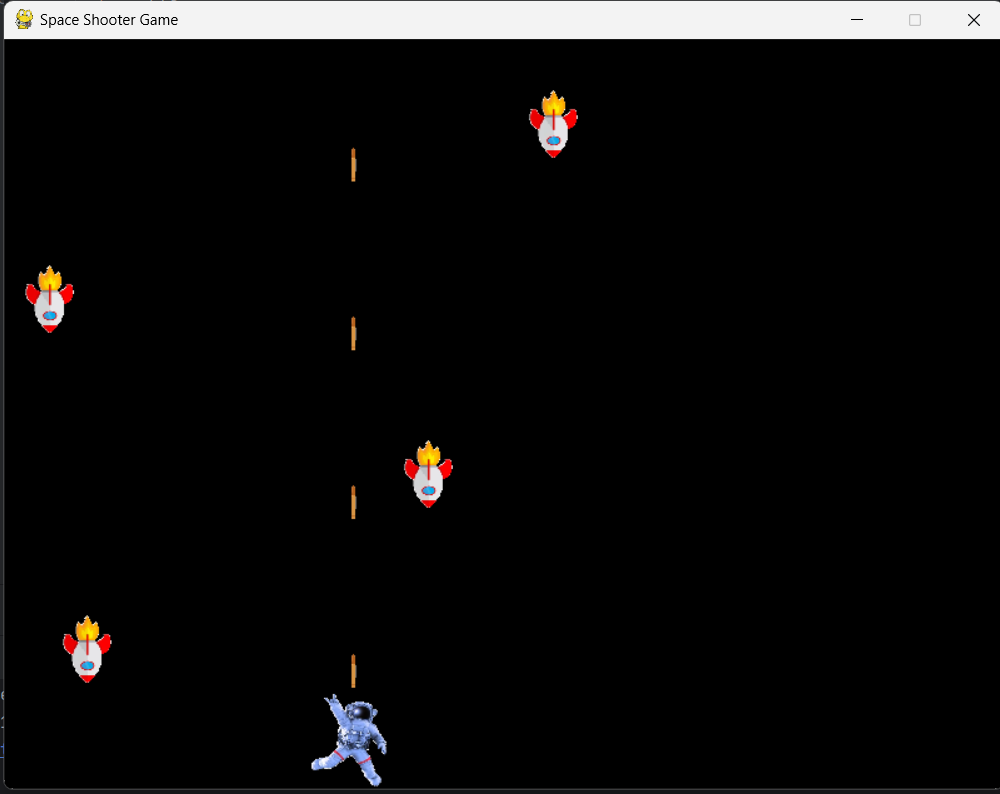

# Space Shooter Game



## Description

This is a simple space shooter game created using Pygame. The player controls a spaceship and shoots down enemy spaceships while avoiding their attacks.

## Features

- Player-controlled spaceship movement.
- Shooting bullets at enemy spaceships.
- Enemy spaceships move in predefined patterns and shoot back.
- Simple collision detection for bullets and enemy spaceships.
- Score tracking.

## Installation

### Prerequisites

- Python 3.x
- Pygame library

### Clone the Repository

```bash
git clone https://github.com/rupesh3433/space-shooter-game.git
cd space-shooter-game
